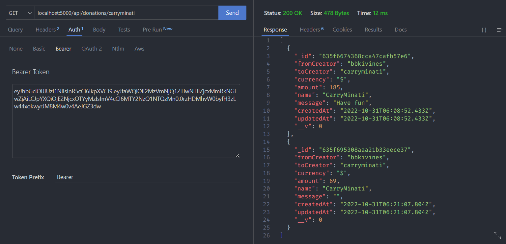

# DUCKCART Demo API

## ROUTES

```text
GET /api/creators
```

- Get all creators, public route

```text
GET /api/donations
```

- Get all donations from logged in creator, protected route

```text
GET /api/donations/:toCreator
```

- Get all donation from logged in creator filtered by toCreator, protected route

```text
POST /api/donations
```

- Create a donation, protected route

```text
POST /api/creators/login
```

- Login a creator

* need username and password

```text
POST /api/creators/signup
```

- Register a creator

* need username, password, confirm password, profile url and profession

## Test the API

### SIGNUP


- Register a creator

* need username, password, confirm password, profile url and profession in the body as JSON

### LOGIN


- Login a creator

* need username and password in the body as JSON

### CREATE DONATION


- Create a donation

* need toCreator, amount, message in the body as JSON and the Bearer token in the Authorization header

### GET ALL DONATIONS


- Get all donations from logged in creator
- need the Bearer token in the Authorization header

### GET DONATIONS filtered by toCreator



- Get all donation from logged in creator filtered by toCreator
- need the Bearer token in the Authorization header

### GET ALL CREATORS


- Get all creators, public route
